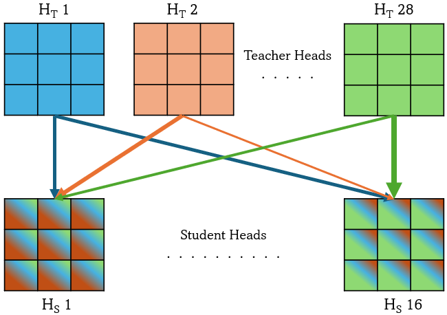
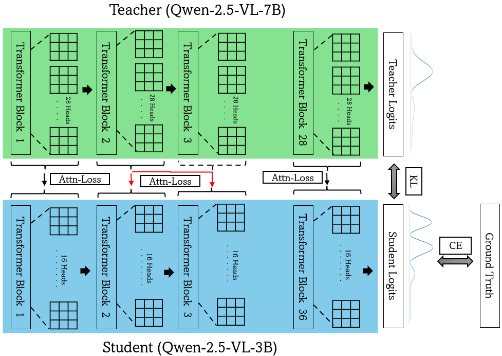
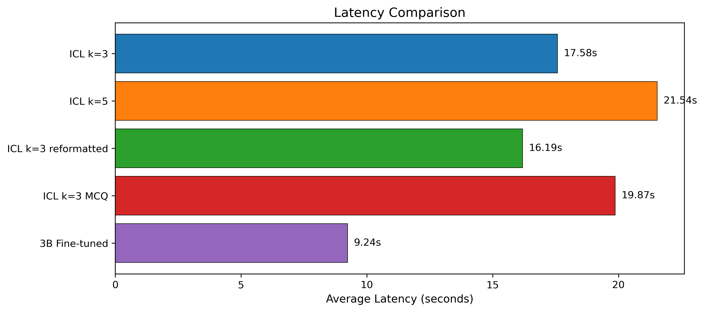
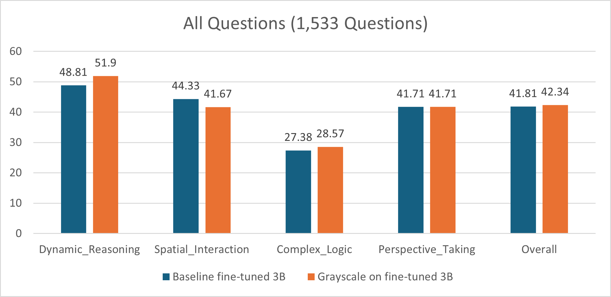
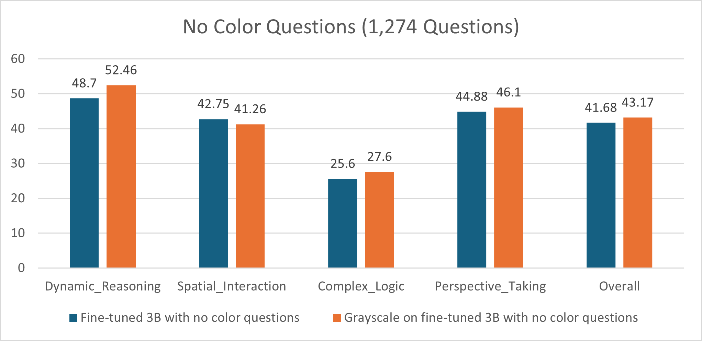

# Improving Spatial Reasoning of Vision Language Models under Resource-Constrained Settings

- Vision language models (VLMs) still struggle with spatial reasoning (e.g., 3D structure, depth, distances, and object relations).
- We investigate whether fine-tuning on synthetic spatial VQA (generated from 2D images using 3D point clouds) improves these abilities.
- We also evaluate lightweight adaptation methods for resource constrained settings, including In-Context Learning (ICL) and distillation (logit-based distillation and attention-based distillation).
- We answer the following questions in our project:
  1. Does fine-tuning on synthetic spatial data improve spatial reasoning of VLMs?
  2. Is in-context learning a feasible alternative to supervised fine-tuning for spatial reasoning?
  3. Could spatial reasoning learned by a large VLM be faithfully distilled into a smaller model while retaining accuracy and reducing computational cost?
  4. Do VLMs rely on geometric structure as we expect them to or does color in images influence their spatial reasoning?

## Datasets:
- Train and Validation - [SpaceThinker](https://huggingface.co/datasets/remyxai/SpaceThinker)
- Test Benchmark - [OmniSpatial](https://huggingface.co/datasets/qizekun/OmniSpatial)

## Pre-trained Models Used in this Project:
- Qwen-2.5-VL-3B
- Qwen-2.5-VL-7B

## Methods:
- **ICL**
  - We test retrieval-based ICL to inject spatial reasoning at inference time (no parameter updates) and compare it to supervised fine-tuning on OmniSpatial.
  - For each OmniSpatial query, we retrieve the top-*K* most similar QA examples from SpaceThinker using a FAISS index (L2 distance) over question embeddings from `all-MiniLM-L6-v2`, with *K* ∈ {3, 5}.
  - Each example includes an image, question, reasoning trace, and final answer.
- **Distillation**
  - We distill spatial reasoning from a larger VLM (Qwen2.5-VL-7B, teacher) into a smaller one (Qwen2.5-VL-3B, student).
  - We use:
    - Vanilla logit-based distillation - (CE + KL with temperature):
      ```math
      \mathcal{L}_{\text{VanillaKD}}
      = \alpha \,\mathrm{CE}(y, z^{S})
      + (1-\alpha)\,T^{2}\,
      \mathrm{KL}\!\left(
        \left(\frac{z^{T}}{T}\right)
        \Big\|
        \left(\frac{z^{S}}{T}\right)
      \right)
      ```
    - Attention-based distillation - to transfer attention behavior despite different head counts (28 vs 16), using similarity weighted head matching and a simple linear mapping for layer mismatches:
      ```math
      \mathcal{L}_{\text{AttnKD}}
      = \sum_{i=1}^{H_T} \mathrm{KL}\!\left(
      t_i \,\middle\|\,
      \sum_{j=1}^{H_S}
      \frac{\exp(\langle t_i, s_j\rangle)}
      {\sum_{j'=1}^{H_S} \exp(\langle t_i, s_{j'}\rangle)}
      \, s_j
      \right)
      ```
      <p align="center">
        
      </p>
    - Layer mapping - when teacher/student depths differ, we map student layer index (zero indexed) via linear mapping:
      ```math
        L_j^T
        = \left(
            \frac{L^T_{Total} - 1}{L^S_{Total} - 1}
            \cdot L_i^S
        \right)
      ```
    - Final distillation loss (weighted combination):
    ```math
    \mathcal{L}_{\text{FinalKD}}
    = \beta\,\mathcal{L}_{\text{AttnKD}} + \gamma\,\mathcal{L}_{\text{VanillaKD}}
    ```
    <p align="center">
        
    </p>
- **Robustness to Grayscale**
  - To check whether spatial reasoning relies on geometry rather than color, we evaluate on both original and grayscale OmniSpatial images.
  - We also create a non-color subset by filtering out color-dependent questions (via regex).
 
## Experimental Results:
- **Supervised Fine-Tuning (SFT)**
  - We fine-tune on SpaceThinker using QLoRA (4-bit NF4, bf16).
  - 3B (SFT): 41.81%, 7B (SFT): 43.57%, 3B (base): 43.44%
  - SpaceThinker-based SFT does not consistently improve on OmniSpatial and its likely due to limited dataset diversity/complexity.

- In-Context Learning (ICL) vs. SFT
  - We use retrieval-based ICL (top-*k* similar SpaceThinker examples per query; *k* ∈ {3, 5}).
  - Naive ICL: 30.59%
  - Best ICL (MCQ-formatted, k=3): 43.44% (surpasses our 3B SFT)
  - Trade-off: higher inference cost (latency nearly 2 times than SFT).
  <p align="center">
    
  </p>

- Distillation vs. SFT
  - Both logit-KD and attention-KD outperform 3B SFT
  - Best: Attention-based KD: 42.98% (still slightly below 7B teacher due to knowledge gap due to difference in capacity/size)
  <p align="center">
    
  </p>

- Robustness to Grayscale
  - Grayscale improves accuracy on both all-questions and non-color splits suggesting color can add noise when irrelevant.
  <p align="center">
    
  </p>
  <p align="center">
    
  </p>

## Conclusion
- Fine-tuning Qwen2.5-VL on SpaceThinker did not improve OmniSpatial accuracy (~43% → ~41%), suggesting SpaceThinker may not target the core spatial challenges.
- ICL (MCQ style) was more effective. Retrieved examples outperformed the fine-tuned model, but increased inference latency.
- Distillation (7B → 3B) surpassed fine-tuning.
- Grayscale inputs consistently outperformed color suggesting irrelevant color can add noise and encourage reliance on appearance cues over spatial structure.

## References:
[1] B. Chen et al., “SpatialVLM: Endowing Vision-Language Models with Spatial Reasoning Capabilities,” arXiv (Cornell University), Jan. 2024, doi: https://doi.org/10.48550/arxiv.2401.12168.


[2] M. Jia, Z. Qi, S. Zhang, W. Zhang, and L. Yi, “OmniSpatial: Towards Comprehensive Spatial Reasoning Benchmark for Vision Language Models,” Jun. 03, 2025. https://www.researchgate.net/publication/392372432_OmniSpatial_Towards_Comprehensive_Spatial_Reasoning_Benchmark_for_Vision_Language_Models

‌
[3] G. Hinton, O. Vinyals, and J. Dean, “Distilling the Knowledge in a Neural Network,” arXiv.org, Mar. 09, 2015. http://arxiv.org/abs/1503.02531

‌
[4] T. Zhao et al., “No Head Left Behind – Multi-Head Alignment Distillation for Transformers,” Proceedings of the AAAI Conference on Artificial Intelligence, vol. 38, no. 7, pp. 7514–7524, Mar. 2024, doi: https://doi.org/10.1609/aaai.v38i7.28583.
